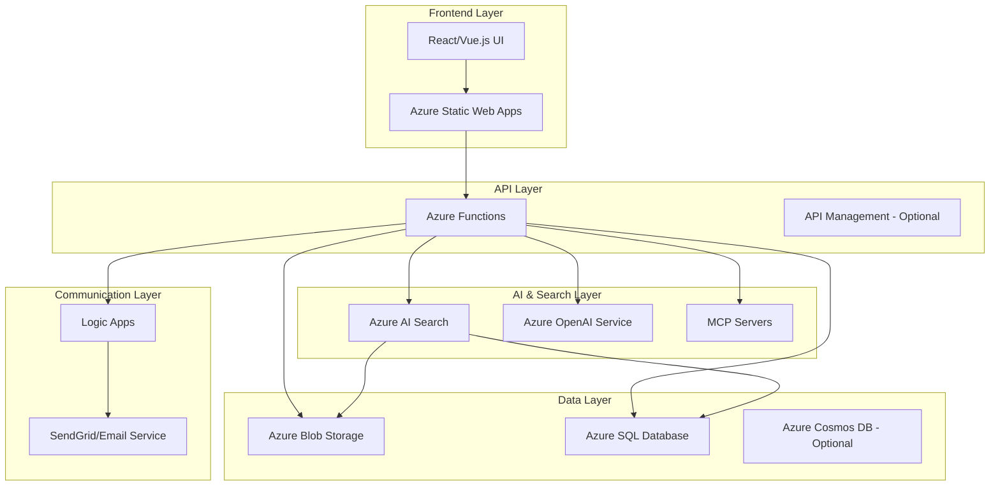

# Design Document

## Overview

The Application Tracking System (ATS) is designed as a modern, cloud-native solution leveraging Azure services for cost-effective candidate management and AI-powered matching. The system follows a serverless architecture pattern using Azure Static Web Apps for the frontend, Azure Functions for backend logic, and Azure AI Search for intelligent candidate matching. The design emphasizes low-code principles, cost optimization, and seamless integration with Gen AI and MCP servers.

## Architecture

### High-Level Architecture



### Technology Stack

- **Frontend**: React.js with TypeScript, hosted on Azure Static Web Apps
- **Backend**: Azure Functions (Node.js/Python)
- **Database**: Azure SQL Database for structured data
- **File Storage**: Azure Blob Storage for resumes and documents
- **Search**: Azure AI Search with semantic search capabilities
- **AI Services**: Azure OpenAI Service for Gen AI features
- **Email**: Azure Logic Apps with SendGrid integration
- **Integration**: MCP (Model Context Protocol) servers for external integrations

## Components and Interfaces

### Frontend Components

#### 1. Candidate Management Module
- **Candidate List View**: Displays all candidates with filtering and sorting
- **Candidate Detail View**: Shows complete candidate information
- **Candidate Form**: Add/edit candidate information with file upload
- **Resume Viewer**: Embedded PDF/document viewer

#### 2. Search Module
- **Job Description Input**: Rich text editor for job descriptions
- **Search Results**: Ranked candidate results with relevance scores
- **Filter Panel**: VISA status, availability, experience level filters
- **Candidate Selection**: Multi-select for email campaigns

#### 3. Email Campaign Module
- **Campaign Builder**: Low-code email template designer
- **Recipient Management**: Selected candidates from search results
- **Campaign Analytics**: Delivery rates, open rates, response tracking
- **Template Library**: Pre-built email templates

#### 4. Configuration Module
- **Search Settings**: AI search parameter configuration
- **Integration Setup**: MCP server and external service configuration
- **User Management**: Role-based access control
- **System Monitoring**: Usage analytics and cost tracking

### Backend APIs

#### 1. Candidate API (`/api/candidates`)
```typescript
interface CandidateAPI {
  GET /candidates - List all candidates with pagination
  GET /candidates/{id} - Get candidate details
  POST /candidates - Create new candidate
  PUT /candidates/{id} - Update candidate
  DELETE /candidates/{id} - Delete candidate
  POST /candidates/{id}/resume - Upload resume file
}
```

#### 2. Search API (`/api/search`)
```typescript
interface SearchAPI {
  POST /search/candidates - Search candidates by job description
  GET /search/suggestions - Get search suggestions
  POST /search/index - Reindex candidate data
}
```

#### 3. Campaign API (`/api/campaigns`)
```typescript
interface CampaignAPI {
  POST /campaigns - Create email campaign
  GET /campaigns/{id} - Get campaign details
  GET /campaigns/{id}/analytics - Get campaign metrics
  POST /campaigns/{id}/send - Send campaign emails
}
```

#### 4. AI API (`/api/ai`)
```typescript
interface AIAPI {
  POST /ai/extract-resume - Extract structured data from resume
  POST /ai/generate-email - Generate personalized email content
  POST /ai/summarize-experience - Create experience summary
}
```

## Data Models

### Candidate Model
```typescript
interface Candidate {
  id: string;
  name: string;
  email: string;
  phone: string;
  resumeUrl: string;
  experienceSummary: string;
  visaStatus: 'Citizen' | 'GreenCard' | 'H1B' | 'F1OPT' | 'RequiresSponsorship';
  availability: 'Immediate' | 'TwoWeeks' | 'OneMonth' | 'NotAvailable';
  skills: string[];
  experience: Experience[];
  createdAt: Date;
  updatedAt: Date;
}

interface Experience {
  company: string;
  title: string;
  duration: string;
  description: string;
  technologies: string[];
}
```

### Job Description Model
```typescript
interface JobDescription {
  id: string;
  title: string;
  description: string;
  requirements: string[];
  preferredSkills: string[];
  location: string;
  visaRequirement: string;
  createdAt: Date;
}
```

### Email Campaign Model
```typescript
interface EmailCampaign {
  id: string;
  name: string;
  jobDescriptionId: string;
  candidateIds: string[];
  emailTemplate: string;
  subject: string;
  status: 'Draft' | 'Sent' | 'Scheduled';
  sentAt?: Date;
  analytics: CampaignAnalytics;
}

interface CampaignAnalytics {
  totalSent: number;
  delivered: number;
  opened: number;
  clicked: number;
  replied: number;
}
```

### Azure AI Search Index Schema
```json
{
  "name": "candidates-index",
  "fields": [
    {"name": "id", "type": "Edm.String", "key": true},
    {"name": "name", "type": "Edm.String", "searchable": true},
    {"name": "email", "type": "Edm.String", "filterable": true},
    {"name": "experienceSummary", "type": "Edm.String", "searchable": true},
    {"name": "skills", "type": "Collection(Edm.String)", "searchable": true, "filterable": true},
    {"name": "visaStatus", "type": "Edm.String", "filterable": true},
    {"name": "availability", "type": "Edm.String", "filterable": true},
    {"name": "resumeContent", "type": "Edm.String", "searchable": true}
  ]
}
```

## Error Handling

### Frontend Error Handling
- **Network Errors**: Retry mechanism with exponential backoff
- **Validation Errors**: Real-time form validation with user-friendly messages
- **File Upload Errors**: Progress indicators and error recovery
- **Search Errors**: Fallback to basic search when AI search fails

### Backend Error Handling
- **API Errors**: Standardized error response format with error codes
- **Azure Service Errors**: Circuit breaker pattern for service resilience
- **AI Service Errors**: Graceful degradation when AI services are unavailable
- **Database Errors**: Connection pooling and retry logic

### Error Response Format
```typescript
interface ErrorResponse {
  error: {
    code: string;
    message: string;
    details?: any;
    timestamp: string;
  };
}
```

## Testing Strategy

### Unit Testing
- **Frontend**: Jest and React Testing Library for component testing
- **Backend**: Jest for Azure Functions testing with mocked dependencies
- **AI Integration**: Mock AI responses for consistent testing

### Integration Testing
- **API Testing**: Postman/Newman for API endpoint testing
- **Azure Services**: Integration tests with Azure SDK
- **Search Testing**: Test search accuracy with sample datasets

### End-to-End Testing
- **User Workflows**: Playwright for complete user journey testing
- **Email Campaigns**: Test email generation and delivery
- **File Upload**: Test resume upload and processing workflows

### Performance Testing
- **Load Testing**: Azure Load Testing for API performance
- **Search Performance**: Test search response times with large datasets
- **Cost Monitoring**: Track Azure resource usage during testing

## Security Considerations

### Authentication & Authorization
- **Azure AD Integration**: Single sign-on for enterprise users
- **Role-Based Access**: Recruiter, Admin, and Viewer roles
- **API Security**: JWT tokens for API authentication

### Data Protection
- **Encryption**: Data encryption at rest and in transit
- **PII Handling**: Secure handling of candidate personal information
- **GDPR Compliance**: Data retention and deletion policies

### Azure Security
- **Network Security**: Virtual network integration for sensitive data
- **Key Management**: Azure Key Vault for secrets and certificates
- **Monitoring**: Azure Security Center for threat detection

## Deployment Strategy

### Infrastructure as Code
- **ARM Templates**: Azure Resource Manager templates for infrastructure
- **GitHub Actions**: CI/CD pipeline for automated deployment
- **Environment Management**: Separate dev, staging, and production environments

### Cost Optimization
- **Consumption-Based Pricing**: Azure Functions consumption plan
- **Storage Tiers**: Appropriate blob storage tiers for different file types
- **Search Optimization**: Right-sized Azure AI Search service tier
- **Monitoring**: Azure Cost Management for budget tracking

### Scalability
- **Auto-scaling**: Automatic scaling based on demand
- **CDN Integration**: Azure CDN for global content delivery
- **Caching**: Redis cache for frequently accessed data
- **Database Scaling**: Azure SQL elastic pools for cost-effective scaling